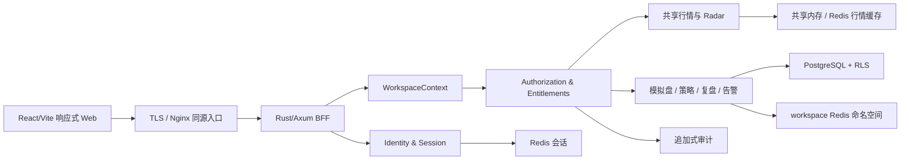

# AlphaPulse 多租户用户管理与订阅基础设计

Date: 2026-07-21

## 目标

把当前单机、匿名、全局状态的 AlphaPulse Web 控制台升级为可邀请他人使用、未来可按个人订阅收费的多租户产品基础，同时保留现有产品定位：

- 提供行情分析、策略观察、模拟交易和策略复盘；
- 首个可销售版本不接 OKX 私有 API，不保存交易所 API Key，不进行真实交易；
- 继续使用当前 React/Vite 响应式 Web，不开发 iOS 或 Android App；
- 复用本地最新 `main` 已支持的语言机制；中文和英文是产品最低要求，当前已有的日文能力也必须保留；
- 首发面向海外华人和亚洲用户，采用邀请制免费内测，稳定后再接个人订阅。

本设计建立从免费邀请内测平滑演进到个人订阅、再到未来团队 workspace 的数据和权限基础。首版不会提前实现复杂团队协作、支付退款或原生移动端。

## 已确认的产品决策

- 商业形态：先做 B2C 个人订阅，底层保留 workspace 抽象。
- 内测方式：邀请制，初期免费，由平台管理员人工开通 Beta 权益。
- 身份方案：托管身份服务提供 OIDC，Rust 后端作为 BFF 管理不透明会话。
- 租户模型：每位首版用户创建一个 personal workspace，并成为唯一 owner。
- 私有数据：模拟账户、策略配置、运行记录、持仓、成交、关注列表和告警规则均归 workspace。
- 管理边界：平台管理员管理邀请、账户状态、权益和审计，但不能静默查看或修改用户的模拟交易数据，也不能模拟登录为用户。
- 移动范围：只做同一套网页版的手机适配，不做 App，也不把 PWA 安装作为首版目标。
- 语言范围：中文和英文是最低发布范围；以本地最新 `main` 为准保留所有已有 locale，当前还包括 `ja`，新增页面进入同一翻译体系。

## 当前系统与改造边界

当前后端是 Axum 模块化单体，但公开路由、WebSocket 和 `RadarState.paper` 使用匿名、全局状态；持久化表没有 user 或 workspace 所有权，应用快照使用固定全局 key。当前前端已经具备：

- `frontend/src/i18n.ts` 中本地最新 `main` 的 `zh` / `en` / `ja` 翻译结构；
- `frontend/src/App.tsx` 中的语言、主题和浏览器本地偏好；
- `frontend/src/ConsoleShell.tsx` 中的业务导航、主题和语言入口；
- `frontend/src/styles.css` 中的响应式断点。

本次改造应增量扩展这些结构，不重写现有 Radar、Macro、策略、模拟盘和复盘业务页面。现有匿名 API、宽松 CORS、全局模拟账户和全局私有广播必须在开放邀请前完成替换。

## 总体架构

采用“现有模块化单体 + 托管 OIDC + 后端 BFF 会话 + workspace 隔离”的方案。

后端继续作为一个可部署单元，内部划分为以下模块：

- Identity & Session：OIDC 回调、用户身份、会话创建和撤销；
- Workspace Context：从会话和成员关系推导当前 workspace；
- Authorization & Entitlements：角色能力、套餐权益、配额和状态校验；
- Audit：安全与管理动作的追加式审计；
- Shared Market Radar：平台共享的 OKX 公共行情、K 线、Radar、Macro 和缓存；
- Paper Trading：workspace 私有模拟账户、持仓、成交、权益和风控；
- Strategy：共享策略目录与 workspace 私有启用配置、运行和订单意图；
- Preferences & Alerts：个人偏好、workspace 告警规则与通知投递偏好。

不拆微服务。等独立模块出现明确的扩缩容、故障隔离或团队所有权需求后，再依据领域边界拆分。

## 数据所有权

最重要的规则是：业务资源使用 `workspace_id`，`user_id` 只表示自然人、个人偏好或动作执行者。

### 平台共享域

不带 `workspace_id`，所有用户复用：

- `strategy_catalog_versions`：平台发布的不可变策略版本；
- 行情、K 线、Radar 和 Macro 快照；
- `plans`、`plan_entitlements`：套餐及能力定义。

### 用户身份域

- `users`：本地用户、状态、展示名和默认语言；
- `identities`：OIDC `issuer + subject` 唯一映射及邮箱快照；
- `user_preferences`：语言、主题、时区等跨设备个人偏好；
- `user_notification_preferences`：通知渠道、安静时段和投递偏好；
- `invitations`：邀请哈希、可选邮箱、状态、到期时间和创建者；
- `legal_acceptances`：已接受的条款、隐私和风险说明版本；
- Redis 会话记录与按用户建立的会话索引：保存活跃设备元数据、有效期和撤销状态；持久审计只记录会话安全事件，不保存 bearer secret；
- `data_requests`：数据导出和删除申请。

### Workspace 私有域

以下表全部要求 `workspace_id NOT NULL`：

- `workspaces`、`memberships`；
- `paper_accounts`；
- `workspace_strategy_profiles`；
- `strategy_runs`、`order_intents`；
- `positions`、`fills`、`closed_trades`；
- `equity_snapshots`、`risk_guard_events`；
- `watchlists`、`workspace_alert_rules`。

首版 personal workspace 和 owner 是一对一，所以用户体验仍然是“我的模拟账户、策略和关注列表”。结构上归 workspace，可以避免将来增加成员时再次迁移核心交易表。告警检测规则归 workspace，具体投递渠道偏好归 user。

### 权益与审计域

- `workspace_subscriptions`：workspace 当前套餐、来源、状态和有效期；
- `subscription_overrides`：管理员临时扩容或延长权益；
- `usage_events`：带幂等键的计量事件；
- `audit_events`：追加式安全审计；
- `domain_event_log`：业务事件，不承担安全审计职责。

### 数据库隔离

- 所有私有查询都必须显式接收 `WorkspaceContext`；
- 每个私有事务执行 `SET LOCAL app.workspace_id = ...`；
- PostgreSQL RLS policy 只允许当前 workspace 的行；
- 父子表使用 `(workspace_id, id)` 复合外键，阻止跨租户关联；
- 唯一约束和高频索引以 `workspace_id` 为首列；
- 私有业务主键统一使用不可猜测 UUID；
- 平台管理员接口只访问控制域表，不获得绕过私有业务 RLS 的应用权限。

## Redis、内存状态与实时事件

- `ap:market:*`：全平台共享行情缓存；
- `ap:session:<hash>`：不透明会话；
- `ap:ws:<workspace_id>:snapshot`：workspace 私有恢复快照；
- 共享行情频道与 workspace 私有事件频道完全分开；
- Redis 不是交易历史真相源，缓存 miss 必须回 PostgreSQL；
- 服务端根据会话绑定私有频道，不接受浏览器随意指定 workspace；
- 断线重连先拉取最新快照，再从最后确认的事件序号继续。

当前 `RadarState.paper` 应拆为共享 `SharedMarketState` 与按 workspace 访问的 `WorkspaceRepository`。模拟账户按请求或事件加载，不把所有用户私有状态放进一个全局锁。

## 邀请、身份与会话流程

### 邀请创建

1. 平台管理员创建一次性高熵邀请链接；
2. 数据库只保存 token 哈希，可选绑定邮箱，默认七天失效；
3. 邀请 token 不进入应用日志、分析事件或下游 Referer；
4. 浏览器打开 `/invite/:token` 后，服务端校验并换成短期 pending-invite 状态，再跳转到不含 token 的地址。

### OIDC 登录与开通

1. 后端生成并保存 `state`、`nonce` 和 PKCE verifier；
2. 浏览器跳转托管身份服务，完成邮箱验证或受支持的社交登录；
3. 回调校验签名、issuer、audience、state、nonce、PKCE 和 redirect URI；
4. 新身份必须带有效 pending invite，已开通身份可正常重新登录；
5. 单个 PostgreSQL 事务创建 `user`、`identity`、personal `workspace`、owner `membership` 和 Beta 权益，并核销邀请；
6. 创建不透明随机会话，OIDC token 和 refresh token 不进入 localStorage。

### 会话契约

- Cookie 名：`__Host-alphapulse_session`；
- 属性：`Secure`、`HttpOnly`、`SameSite=Lax`、`Path=/`，不设置 Domain；
- 空闲超时 24 小时，绝对有效期 30 天，后续只通过安全配置调整；
- 登录、权限变化和敏感操作后轮换会话 ID；
- 退出、用户停用、安全事件和“退出其他设备”立即撤销会话；
- 写请求同时校验 Origin 和 CSRF token；
- WebSocket 握手校验会话与 Origin。

首版关键接口包括：

- `GET /invite/:token`；
- `GET /auth/login`；
- `GET /auth/callback`；
- `POST /api/auth/logout`；
- `GET /api/bootstrap`；
- `POST /api/admin/invitations`；
- 用户偏好、会话、导出和删除申请接口；
- 管理员用户状态、权益和审计接口。

## 权限模型

### 首版生效身份

Workspace Owner：

- 读取共享行情和宏观信息；
- 管理自己 workspace 的模拟账户、策略、关注列表和告警；
- 管理自己的偏好、会话、数据导出和删除申请。

平台管理员：

- 创建和撤销邀请；
- 查看用户和 workspace 的控制信息；
- 停用或恢复用户和 workspace；
- 人工开通、延长或撤销 Beta 权益；
- 检索追加式审计。

平台管理员不能：

- 查看或修改用户私有模拟交易数据；
- 绕过 workspace RLS；
- 模拟登录为用户；
- 无原因执行敏感管理动作。

未来可启用 `owner / admin / operator / viewer` workspace 角色，但首版不展示团队入口，也不实现成员邀请或角色编辑。服务端从第一天使用 capability，而不是在前端硬编码套餐名或角色名。

### 请求校验顺序

每次私有请求依次校验：

1. 是否存在有效会话；
2. user 和 workspace 是否可用；
3. 是否存在成员关系或允许的平台管理身份；
4. 是否拥有对应 capability；
5. 套餐权益和配额是否满足；
6. 资源是否属于当前 workspace；
7. 执行并记录必要审计。

代表性 capability：

- `market.read`、`macro.read`；
- `paper.read`、`paper.trade`；
- `strategy.read`、`strategy.run`、`strategy.reset`；
- `review.read`、`watchlist.manage`、`alerts.manage`；
- `account.manage`、`workspace.manage`；
- `admin.invites.manage`、`admin.users.suspend`、`admin.entitlements.grant`、`admin.audit.read`。

### 停用语义

- user suspended：撤销该用户所有会话并阻止登录；
- workspace suspended：阻止进入产品业务区，但允许 owner 查看停用原因并发起导出或删除申请；
- subscription expired：不是停用，按只平仓和只读状态处理。

## 订阅与权益

内测期创建一个免费 Beta plan，通过 `workspace_subscriptions.source = manual` 开通并设置有效期；临时扩容或延期使用 `subscription_overrides`。前端只消费服务端返回的 capabilities、quota 和 entitlement status，不判断 `plan == "pro"`。

首版权益契约至少包括：

- `can_paper_trade`；
- `can_run_strategy`；
- `alerts_enabled`；
- `history_retention_days`；
- `max_active_strategies`；
- 后续需要的速率或数据保留配额。

订阅到期状态机：

1. `Active`：正常开仓、平仓和运行策略；
2. `Grace / Close-only`：禁止新开仓和新策略动作，允许人工平仓、止损止盈退出并继续更新价格；
3. `Expired / Read-only`：暂停策略，持仓继续估值，允许查看和导出，不因订阅到期人为生成平仓记录；
4. `Renewed`：恢复权益后由用户显式重新启动策略。

宽限期天数作为 plan 配置，不写死在业务代码。免费邀请内测不接支付；支付、账单、退款和价格只在产品稳定性与留存验证后进入商业化阶段。

## API 与 WebSocket 运行链路

`GET /api/bootstrap` 是登录后的首个上下文请求，返回：

- 当前 user 和 workspace；
- membership 和有效 capabilities；
- plan、quota 和 entitlement status；
- 语言、主题和时区偏好；
- 产品可用状态和必要的功能开关。

共享读请求进入 Shared Market 服务并复用内存或 Redis 行情缓存。私有读写请求必须携带服务端创建的 `WorkspaceContext`，在数据库事务中设置 RLS 上下文。浏览器提交的资源 ID 只用于定位资源，不能决定租户身份。

WebSocket 使用同一登录会话：

- 握手校验会话和 Origin；
- 共享 market 频道只发送公共行情；
- 私有频道由服务端绑定当前 workspace；
- 私有事件携带单调序号，支持快照加增量重连；
- 客户端不能通过消息订阅任意 workspace；
- 会话撤销或 workspace 停用后立即断开私有连接。

## 标准错误与网页行为

- `AUTH_REQUIRED`：保存当前地址，重新登录后返回；
- `ACCOUNT_SUSPENDED`：显示停用原因和允许的后续动作；
- `WORKSPACE_FORBIDDEN`：拒绝访问，不尝试前端绕过；
- `CAPABILITY_FORBIDDEN`：说明当前身份不能执行该动作；
- `PLAN_REQUIRED`：说明缺少的产品能力；
- `QUOTA_EXCEEDED`：显示配额和恢复时间；
- `VERSION_CONFLICT`：刷新模拟账户最新版本，避免覆盖并发请求；
- `RATE_LIMITED`：按照服务端给出的等待时间重试；
- `UPSTREAM_UNAVAILABLE`：显示行情陈旧时间，暂停依赖新价格的策略动作。

所有错误页、空状态和恢复动作必须覆盖实现基线中的全部 locale；中文和英文是最低发布门槛，不能降级本地最新 `main` 已有的日文能力。

## 响应式 Web 与多语言体验

### 页面范围

登录前：

- `/invite/:token` 邀请校验；
- `/login` 登录和语言切换；
- `/auth/error` 双语错误与恢复；
- 隐私、条款和模拟交易风险说明。

现有产品区：

- 继续使用 Radar、Macro、策略、模拟盘和策略复盘；
- 继续使用现有 `ConsoleShell`；
- 只接入登录状态、workspace、capability 和 entitlement。

新增管理区：

- 个人资料、语言、主题和时区；
- 活跃会话和退出其他设备；
- 数据导出和删除申请；
- 平台管理员的邀请、用户、权益和审计页面。

### 桌面和手机浏览器

- 桌面保留当前左侧导航与主内容结构；
- 手机使用相同路由和组件，将主导航收进紧凑 Web 导航；
- 顶部保留页面标题、连接状态和账户入口，次要指标进入展开区；
- 表单改为单列；无法压缩的表格局部横向滚动或转换为摘要行；
- 危险管理动作在手机端使用清晰的全屏确认层；
- 浏览器通知继续作为可选能力，拒绝通知不阻塞使用。

不开发原生 App，不复制第二套前端，不要求用户安装 PWA，不引入原生推送。

### 语言优先级

- 未登录：浏览器语言或用户本地选择；
- 登录后：`user_preferences.language` 优先；
- 用户切换语言：写回服务端，并同步本地存储以减少首屏闪烁；
- 所有新增页面共用本地最新 `main` 的语言字典和入口；当前支持 `zh / en / ja`。

当前代码中的硬编码页面文案应在本次范围内逐步归入现有翻译结构，但不重建新的国际化框架。

### 首次进入流程

1. 接受邀请并完成 OIDC 登录；
2. 确认语言和时区；
3. 接受当前版本的条款、隐私和模拟交易风险说明；
4. 初始化 workspace 私有模拟账户和默认策略配置；
5. 可选请求浏览器通知权限；
6. 进入现有产品控制台。

## 安全、隐私与审计

- 生产只允许 HTTPS / WSS；
- 同源部署优先不启用跨域，必须跨域时使用精确 allowlist，禁止通配凭证 CORS；
- 所有写接口使用 CSRF 和 Origin 校验；
- 登录、邀请、管理接口和交易写接口分别限速；
- 设置 CSP、HSTS、frame 限制、MIME 嗅探防护和安全 Referrer Policy；
- 不在日志中记录会话、OIDC token、邀请 token、CSRF token 或完整敏感请求体；
- 用户邮箱等个人信息在运行日志和指标标签中最小化；
- 备份与数据库连接使用加密和最小权限；
- 管理员敏感动作需要确认、原因和追加式审计；
- 首版不提供 impersonation；紧急数据库排障属于独立 break-glass 运维流程，不是产品功能。

`audit_events` 至少记录：

- `occurred_at`、`request_id`；
- `actor_user_id`、actor 类型；
- `workspace_id`；
- `action`、target 类型和 target ID；
- 结果、失败原因和来源 IP 摘要；
- 管理动作原因；
- 不含会话、token 和不必要的业务敏感正文。

审计记录只追加，不通过普通应用接口更新或删除。业务事件继续写入独立 `domain_event_log`。

## 可观测性与可靠性

- 每个请求和实时事件携带 `request_id`；
- 私有链路日志可关联 user、workspace 和请求，但不把个人信息作为高基数指标标签；
- 监控登录失败、邀请滥用、会话撤销、权限拒绝、RLS 拒绝、行情陈旧、WebSocket 重连、模拟账户版本冲突和持久化延迟；
- 管理动作审计与运行日志分开存储和检索；
- 在开放邀请前完成数据库备份、恢复和迁移回滚演练；
- 行情不可用时保持最后更新时间可见，并停止依赖新价格的自动策略动作；
- 关键写操作使用幂等键或版本号，避免重试造成重复成交或重复权益计量。

## 数据迁移

当前没有外部用户，采用一次可回滚的维护迁移，不建设长期双写。

1. 引入正式 `sqlx migrations`，停止应用启动时拼接 `CREATE TABLE`；
2. 做数据库备份和恢复演练；
3. 创建 user、identity、workspace、membership、invitation、plan、subscription 和 audit 控制域；
4. 为现有本地数据创建 legacy owner 和 personal Legacy Workspace；
5. 私有业务表先增加 nullable `workspace_id`，完成回填和核对；
6. 添加 `NOT NULL`、复合外键、workspace 索引和 RLS；
7. API、持久化、Redis key 和 WebSocket 切换到 `WorkspaceContext`；
8. 移除全局 `versioned_paper_state` 和旧全局私有 key；
9. 比对行数、余额、持仓、PnL、交易历史和快照校验值；
10. 保留明确回滚窗口，通过后清理旧结构。

现有表演进：

- `strategy_versions` 拆为共享 `strategy_catalog_versions` 和私有 `workspace_strategy_profiles`；
- `strategy_runs`、`order_intents` 增加 workspace 所有权并绑定 profile；
- positions、fills、closed trades、equity 和 risk 表增加 workspace 所有权；
- `event_log` 明确为 `domain_event_log`，另建 `audit_events`；
- 固定 key 的 `app_state_snapshots` 只作为过渡恢复快照，规范化交易表成为真相源。

## 测试策略

### 单元测试

- capability 与角色映射；
- entitlement、quota、override 和到期状态机；
- 邀请状态转换和幂等核销；
- 会话轮换和撤销；
- close-only 对模拟盘和策略动作的限制。

### 数据库与集成测试

- 每张私有表的跨 workspace IDOR 被应用校验和 RLS 双重拒绝；
- 复合外键不能跨 workspace 关联；
- 平台管理员无法读取私有交易表；
- 并发模拟交易触发版本冲突而非覆盖；
- usage event 和管理操作重试保持幂等；
- user 或 workspace 停用会撤销会话和私有 WebSocket。

### WebSocket 测试

- 共享行情可多租户复用；
- 私有快照和事件不串租户；
- 非法 Origin 和失效会话被拒绝；
- 断线重连不会丢失或重复执行模拟交易动作。

### 端到端测试

- 邀请有效、过期、重复使用和邮箱不匹配；
- 首次登录、重新登录、退出和退出其他设备；
- 本地最新 `main` 支持的全部 locale 的邀请、登录、设置、错误和管理员页面；
- 桌面和手机浏览器的导航、表单、表格和确认动作；
- 权益到期后的 close-only、只读、导出和续费恢复；
- 明确验证产品中不存在真实交易和 OKX 私有凭证入口。

### 迁移测试

- Legacy Workspace 回填前后行数一致；
- 初始余额、可用余额、持仓、成交、已实现和未实现 PnL 一致；
- 备份恢复和迁移回滚演练通过；
- 旧全局 key 清理前后产品快照一致。

## 分阶段上线

### Phase 0：安全地基

- 正式迁移框架；
- TLS 同源入口；
- 托管 OIDC 与后端会话；
- WorkspaceContext、RLS、capability、entitlement 和 audit；
- 共享与私有状态拆分。

### Phase 1：迁移与内部验证

- 创建 Legacy Workspace 并迁移现有数据；
- 内部 owner 和平台管理员走完整流程；
- 完成隔离、备份恢复、双语和响应式验证。

### Phase 2：免费邀请内测

- 开放一次性邀请；
- 开放个人设置、会话管理、导出和删除申请；
- 管理员人工开通权益、停用账户和检索审计；
- 保持只做行情分析和模拟交易。

### Phase 3：个人订阅商业化

- 稳定性、运维能力和留存达到发布门槛后再选择支付供应商；
- 接入支付、账单、退款、套餐升级和到期通知；
- 继续以 workspace entitlement 驱动产品能力。

## 邀请内测发布门槛

- 跨租户自动化测试全部通过；
- 备份恢复和迁移回滚演练通过；
- 本地最新 `main` 支持的全部 locale 关键流程通过，中文和英文为最低发布门槛；
- 桌面和手机浏览器关键流程通过；
- 会话撤销、管理员审计和速率限制通过；
- Legacy Workspace 的余额、持仓、成交和 PnL 核对通过；
- 生产 HTTPS / WSS 和安全响应头生效；
- 日志与审计不泄露 token、会话或邀请凭证；
- 没有真实交易、OKX API Key 或私有交易所接口。

## 有意后置的选择

以下选择不改变本设计的数据和权限边界：

- 具体托管 OIDC 供应商：实施前按 OIDC 标准兼容、亚洲可用性、社交登录、价格、数据区域和导出能力选择；
- 具体支付供应商、价格和套餐配额：Phase 3 决定；
- close-only 宽限期天数：作为 plan 配置，在正式收费前确定；
- 团队成员邀请及 `admin / operator / viewer`：个人订阅稳定后再启用；
- 客服授权查看私有数据：首版明确不做，未来如确有需求，必须另行设计用户主动授权、只读范围、短期有效期和审计。

这些后置选择不能成为绕过 workspace 隔离、平台管理员边界或响应式 Web 范围的理由。
